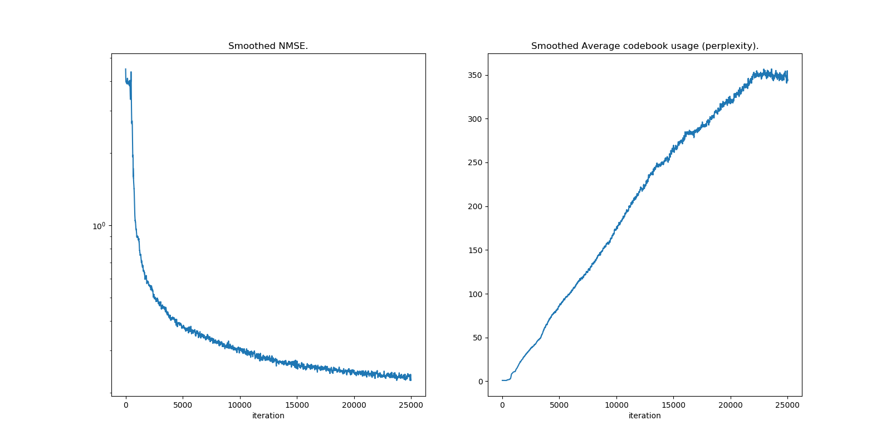
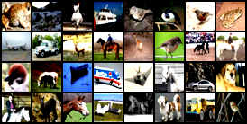
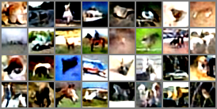

PyTorch implementation of VQ-VAE by [van den Oord et al., 2017] applied to CIFAR10 dataset by [Alex Krizhevsky, 2009] using classes, inspired from the code of [zalandoresearch/pytorch-vq-vae] and [deepmind/sonnet].

# Results

The trained models used in the following experiments are saved in `results/shuffled` and `results/unshuffled/` directories.

The experiments was shorter than necessary as it was only for educational purpose. In order to obtain better image reconstructions, it is necessary to increase the number of residual hidden neurons (ie., 256 instead of 256) and to increase the number of training updates (ie., 250K instead of 25K).

## Using original version

Reconstruction loss plot using the original version by [van den Oord et al., 2017]:


The original images:


The reconstructed images:


## Using EMA updates

In my experiments, using the EMA updates proposes in [Roy et al., 2018], the final reconstruction loss was 2.66 times smaller (0.235 instead of 0.627) for shuffled dataset, and similar for unshuffled dataset:



The original images:


As we can see, the reconstructed images are less blurred than the previous ones:


## Using EMA updates + kaiming normal

One can also use the weight normalization proposed by [He, K et al., 2015], as the model converges a little faster.


The original images :



The reconstructed images :



I also used `nn.utils.weight_norm()` before each call of `kaiming_normal()`, as they do in [ksw0306/ClariNet] because the model converged better. In my experiments, EMA + kaiming without this additional normalisation reduces the performances, as we can see in the [additional results](results/shuffled/loss_ema_he-et-al.png).

# Installation

It requires python3, python3-pip and the packages listed in [requirements.txt](requirements.txt).

To install the required packages:
```bash
pip3 install -r requirements.txt
```

# Examples of usage

First, move to the source directory:
```bash
cd src
```

```bash
python3 main.py --help
```

Output:
```
usage: main.py [-h] [--batch_size [BATCH_SIZE]]
               [--num_training_updates [NUM_TRAINING_UPDATES]]
               [--num_hiddens [NUM_HIDDENS]]
               [--num_residual_hiddens [NUM_RESIDUAL_HIDDENS]]
               [--num_residual_layers [NUM_RESIDUAL_LAYERS]]
               [--embedding_dim [EMBEDDING_DIM]]
               [--num_embeddings [NUM_EMBEDDINGS]]
               [--commitment_cost [COMMITMENT_COST]] [--decay [DECAY]]
               [--learning_rate [LEARNING_RATE]]
               [--use_kaiming_normal [USE_KAIMING_NORMAL]]
               [--shuffle_dataset [SHUFFLE_DATASET]] [--data_path [DATA_PATH]]
               [--results_path [RESULTS_PATH]]
               [--loss_plot_name [LOSS_PLOT_NAME]] [--model_name [MODEL_NAME]]
               [--original_images_name [ORIGINAL_IMAGES_NAME]]
               [--validation_images_name [VALIDATION_IMAGES_NAME]]
               [--use_cuda_if_available [USE_CUDA_IF_AVAILABLE]]

optional arguments:
  -h, --help            show this help message and exit
  --batch_size [BATCH_SIZE]
                        The size of the batch during training (default: 32)
  --num_training_updates [NUM_TRAINING_UPDATES]
                        The number of updates during training (default: 25000)
  --num_hiddens [NUM_HIDDENS]
                        The number of hidden neurons in each layer (default:
                        128)
  --num_residual_hiddens [NUM_RESIDUAL_HIDDENS]
                        The number of hidden neurons in each layer within a
                        residual block (default: 32)
  --num_residual_layers [NUM_RESIDUAL_LAYERS]
                        The number of residual layers in a residual stack
                        (default: 2)
  --embedding_dim [EMBEDDING_DIM]
                        Representing the dimensionality of the tensors in the
                        quantized space (default: 64)
  --num_embeddings [NUM_EMBEDDINGS]
                        The number of vectors in the quantized space (default:
                        512)
  --commitment_cost [COMMITMENT_COST]
                        Controls the weighting of the loss terms (default:
                        0.25)
  --decay [DECAY]       Decay for the moving averages (set to 0.0 to not use
                        EMA) (default: 0.99)
  --learning_rate [LEARNING_RATE]
                        The learning rate of the optimizer during training
                        updates (default: 0.0003)
  --use_kaiming_normal [USE_KAIMING_NORMAL]
                        Use the weight normalization proposed in [He, K et
                        al., 2015] (default: True)
  --shuffle_dataset [SHUFFLE_DATASET]
                        Shuffle the dataset before training (default: True)
  --data_path [DATA_PATH]
                        The path of the data directory (default: data)
  --results_path [RESULTS_PATH]
                        The path of the results directory (default: results)
  --loss_plot_name [LOSS_PLOT_NAME]
                        The file name of the training loss plot (default:
                        loss.png)
  --model_name [MODEL_NAME]
                        The file name of trained model (default: model.pth)
  --original_images_name [ORIGINAL_IMAGES_NAME]
                        The file name of the original images used in
                        evaluation (default: original_images.png)
  --validation_images_name [VALIDATION_IMAGES_NAME]
                        The file name of the reconstructed images used in
                        evaluation (default: validation_images.png)
  --use_cuda_if_available [USE_CUDA_IF_AVAILABLE]
                        Specify if GPU will be used if available (default:
                        True)
```

Use default vector quantized algorithm, do not shuffle the dataset and do not use [He, K et al., 2015] weight normalization:
```bash
python3 main.py --shuffle_dataset=False --results_path="results/shuffled/" --use_kaiming_normal=False --decay=0.0
```

Use EMA vector quantized algorithm, do not shuffle the dataset and do not use [He, K et al., 2015] weight normalization:
```bash
python3 main.py --shuffle_dataset=False --results_path="results/shuffled/" --use_kaiming_normal=False --decay=0.99 --loss_plot_name="loss_ema.png" --model_name="model_ema.pth" --original_images_name="original_images_ema.png" --validation_images_name="validation_images_ema.png"
```

Use EMA vector quantized algorithm, do not shuffle the dataset and do use [He, K et al., 2015] weight normalization:
```bash
python3 main.py --shuffle_dataset=False --results_path="results/shuffled/" --use_kaiming_normal=True --decay=0.99 --loss_plot_name="loss_ema_norm_he-et-al.png" --model_name="model_ema_norm_he-et-al.pth" --original_images_name="original_images_ema_norm_he-et-al.png" --validation_images_name="validation_images_ema_norm_he-et-al.png"
```

# Code usage

Example of usage (see [here](src/main.py) for the complete example):
```py
configuration = Configuration.build_from_args(args) # Get the dataset and model hyperparameters
dataset = Cifar10Dataset(configuration.batch_size, dataset_path) # Create an instance of CIFAR10 dataset
auto_encoder = AutoEncoder(device, configuration).to(device) # Create an AutoEncoder model using our GPU device

optimizer = optim.Adam(auto_encoder.parameters(), lr=configuration.learning_rate, amsgrad=True) # Create an Adam optimizer instance
trainer = Trainer(device, auto_encoder, optimizer, dataset) # Create a trainer instance
trainer.train(configuration.num_training_updates) # Train our model on the CIFAR10 dataset
trainer.save_loss_plot(results_path + os.sep + 'loss.png') # Save the loss plot
auto_encoder.save(results_path + os.sep + 'model.pth') # Save our trained model

evaluator = Evaluator(device, auto_encoder, dataset) # Create en Evaluator instance to evaluate our trained model
evaluator.reconstruct() # Reconstruct our images from the embedded space
evaluator.save_original_images_plot(results_path + os.sep + 'original_images.png') # Save the original images for comparaison purpose
evaluator.save_validation_reconstructions_plot(results_path + os.sep + 'validation_images.png') # Reconstruct the decoded images and save them
```

# References

* [van den Oord et al., 2017] [van den Oord A., and Oriol Vinyals. "Neural discrete representation learning." Advances in Neural Information Processing Systems(NIPS). 2017](https://arxiv.org/abs/1711.00937).

* [Alex Krizhevsky, 2009] [Learning Multiple Layers of Features from Tiny Images](https://www.cs.toronto.edu/~kriz/learning-features-2009-TR.pdf).

* [zalandoresearch/pytorch-vq-vae] https://github.com/zalandoresearch/pytorch-vq-vae.

* [deepmind/sonnet] https://github.com/deepmind/sonnet/blob/master/sonnet/examples/vqvae_example.ipynb.

* [Roy et al., 2018] [A. Roy, A. Vaswani, A. Neelakantan, and N. Parmar. Theory and experiments on vector quantized autoencoders.arXiv preprint arXiv:1805.11063, 2018](https://arxiv.org/abs/1805.11063).

* [He, K et al., 2015] [He, K., Zhang, X., Ren, S and Sun, J. Deep Residual Learning for Image Recognition. arXiv e-prints arXiv:1502.01852](https://arxiv.org/abs/1512.03385).

* [ksw0306/ClariNet] https://github.com/ksw0306/ClariNet.
