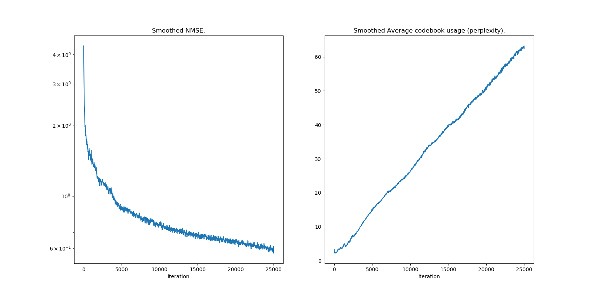
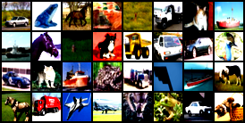
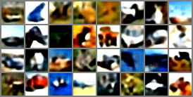
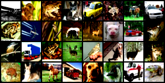
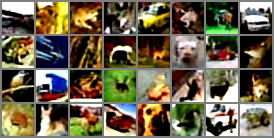

PyTorch implementation of VQ-VAE by [van den Oord et al., 2017] applied to CIFAR10 dataset by [Alex Krizhevsky, 2009] using classes, inspired from the code of [zalandoresearch/pytorch-vq-vae], itself inspired from [deepmind/sonnet] code.

# Usage

Example of usage (see [here](src/main.py) for the complete example):
```py
device = torch.device("cuda" if torch.cuda.is_available() else "cpu") # Use GPU if cuda is available

configuration = Configuration(decay=0.99 if use_ema else 0.0) # Get the dataset and model hyperparameters
dataset = Cifar10Dataset(configuration.batch_size, dataset_path) # Create an instance of CIFAR10 dataset
auto_encoder = AutoEncoder(device, configuration).to(device) # Create an AutoEncoder model using our GPU device

optimizer = optim.Adam(auto_encoder.parameters(), lr=configuration.learning_rate, amsgrad=True) # Create an Adam optimizer instance
trainer = Trainer(device, auto_encoder, optimizer, dataset) # Create a trainer instance
trainer.train(configuration.num_training_updates) # Train our model on the CIFAR10 dataset
trainer.save_loss_plot(results_path + os.sep + 'loss.png') # Save the loss plot
auto_encoder.save(results_path + os.sep + 'model.pth') # Save our trained model

evaluator = Evaluator(device, auto_encoder, dataset) # Create en Evaluator instance to evaluate our trained model
evaluator.reconstruct() # Reconstruct our images from the embedded space
evaluator.save_original_images_plot(results_path + os.sep + 'original_images.png') # Save the original images for comparaison purpose
evaluator.save_validation_reconstructions_plot(results_path + os.sep + 'validation_images.png') # Reconstruct the decoded images and save them
```

# Results

The trained models used in the following experiments are saved in `results/model.pth` and `results/model_ema.pth`.

## Using original version

Reconstruction loss plot using the original version by [van den Oord et al., 2017]:



The original images:



The reconstructed images:



## Using EMA updates

In my experiments, using the EMA updates proposes in [Roy et al., 2018], the final reconstruction loss was 2.66 times smaller (0.235 instead of 0.627):


The original images:



As we can see, the reconstructed images are less blurred than the previous ones:



# Installation

It requires python3, python3-pip and the packages listed in [requirements.txt](requirements.txt).

To install the required packages:
```bash
pip3 install -r requirements.txt
```

# References

[van den Oord et al., 2017] van den Oord A., and Oriol Vinyals. "Neural discrete representation learning." Advances in Neural Information Processing Systems(NIPS). 2017.

[Alex Krizhevsky, 2009] Learning Multiple Layers of Features from Tiny Images.

[zalandoresearch/pytorch-vq-vae] https://github.com/zalandoresearch/pytorch-vq-vae.

[deepmind/sonnet] https://github.com/deepmind/sonnet/blob/master/sonnet/examples/vqvae_example.ipynb.

[Roy et al., 2018] A. Roy, A. Vaswani, A. Neelakantan, and N. Parmar. Theory and experiments on vector quantized autoencoders.arXiv preprint arXiv:1805.11063, 2018.
